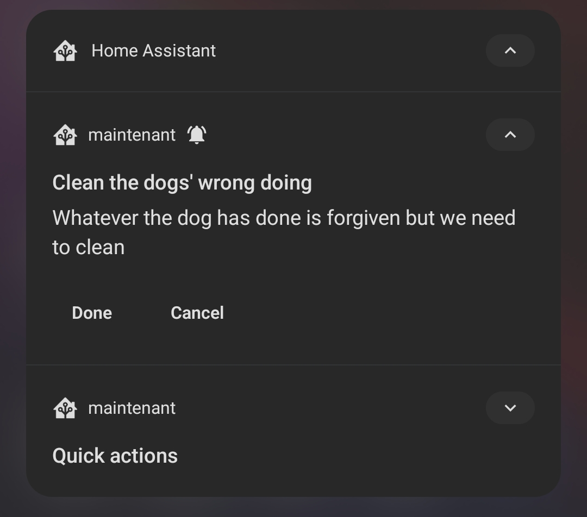
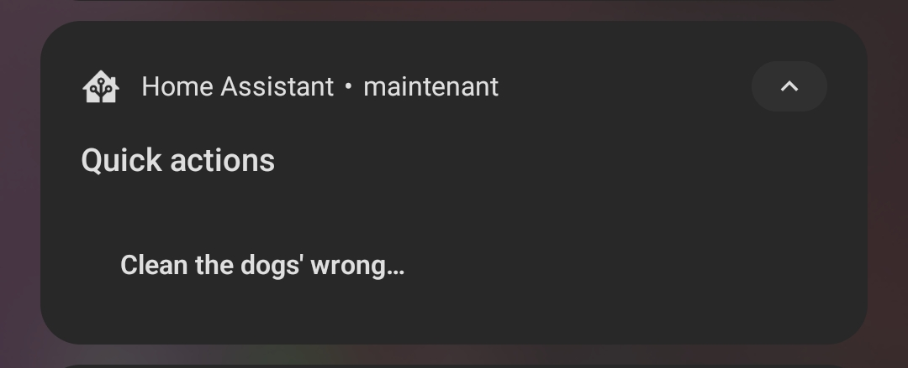

# Family companion

Simple task manager addon for Home assistant.

It helps follow the tasks to do or not when at home. It uses the companion app notification system in order to manage notification and actions.

When a task is triggered (has to be done) a notification will show up on the mobile phone of everyone at home.

A quick action notification is also convenient for triggering something you've seen somewhere that has to be done.

<div style="display: flex">


</div>

Eveything can be configured from the UI of the addon (which displays a panel accessible by everyone with **write** capability, so please **care** when sharing):

Sorry for the lame video for now:

<video controls width="100%" style="max-width: 600px">
  <source src="docs/demo_ui.webm" type="video/webm" />
</video>

# Installation

Add this repository to your addon repositories. Family companion should be avaialble.

Installation takes 2 minutes on my RPI4.

# Documentation

## Task trigger

A task will be triggered if it has a CRON string (look on google for what it is) or if HA triggers an event "trigger_task" with as parameter

```
{
  id: "task_id"
}
```

When creating task, please provide meaning full but HA compliant ids like "clean_dishes_in_kitchen".

## Events

This addon will trigger events in HA in order for you to automate actions.

### task_triggered

This event is triggered when a task is triggered either with CRON or HA event

Parameter:

```json
{
  "task": {}, // Task triggered
  "job": {} // Resulting job to fullfil
}
```

### task_completed / task_canceled

This event is triggered when a task has been completed / canceled through a notification action

Parameter:

```json
{
  "task": {}, // Task triggered
  "job": {}, // Job related to the action,
  "person": "person.someone" // Person triggering the action
}
```

## Notification

This addon is deeply integrated with companion app. Each person should set there companion app name to their person name example:
user Paul, is an entity Person with id person.paul. It should have a service called mobile_app_paul.

To do so, go in the companion app settings, select the server, change the name. Reboot the companion app, it'll trigger the new service.

Notifications have actions in order to complete or cancel them. This will allow the addon to follow who did what and when.

### Quick actions

Some tasks can be set up as quick action. This will add a persistent notification that allows to trigger the task. Android allow up to 3 buttons. So consider no adding to much quick actions.

### Click Action

A `notificationURL` can be set up in the addon configuration. It sets up the click action redirection when clicking on the notification.

## CRON strings

This application uses CRON strings to determine the next iterations of the tasks.
The CRON lib used is: https://github.com/datasert/cronjs. Read their doc to fully understand how to define recurrent (or not) tasks

## Translations

EN and FR Supported. Set language in the configuration of the addon.

## Log

Log level goes from 0 to 4 (debug, info, warning, error)
Full logs can be downloaded from the UI.

# Next steps

- Tests (unit) + CI with coverage
- Change log
- Test (integration)
- Reduce docker size (337MB, should be able to reduce it to around 230MB)

# Contributing

I'll review PR for now (2023-04-27).
